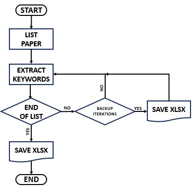
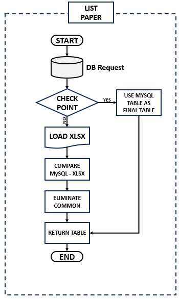

# snuh_keywords
## 🔽리포지토리 내려받기
```
git clone https://github.com/Saltlux1/snuh_keywords
```
## 💾데이터베이스 연결
데이터베이스 연결 정보는 <b>db_connect.py</b> 파일에 있으면 데이터베이스 접속할 필요가 있는 스크립트 <b>db_connect.py</b> 파일을 이용해서 데이터베이스 접속 정보를 바꾸면 이 파일 라인 6부터 라인 9까지만 수정해야 한다.

## 🏝 가상환경
```
cd snuh_keywords
pip install -r requirements 
```
### 🎛모댈들 내려받기
```
cd snuhkeywords
python download_models.py
```
## 📋키워드 추출
키워드 추출 작업 3개 있다. 1번째는 논문 제목와 초록, 2번째는 연구과제, 3번째는 특허에서 키워드 추출하는 작업이에요. 키워드 추출하기 위해서 가상환경 활요화한 다음에 다음과 같은 명령을 실행하면 된다.
### 📕논문
```
cd snuh_keywords
python paper.py
```
### 📗연구과제
```
cd snuhkeywords
python project.py
```
### 📘특허
```
cd snuh_keywords
python patent.py
```
## 📤데이터베이스 업데이트
키워드 파일 만든 다음에 데이터베이스 테이블 말들고 추출한 키워드 업로드 해주는 프로그램은 <b>db_make.py</b>이다. 실행하기 위해서 다음과 같은 명령을 실행해야 해요.
```
cd snuh_keywords
python db_make.py
```
생성하는 테이블:
<ol>
  <li>
    <b>논문 키워드:</b> FCT_PAPER_KEYWORDS
  </li>
  <li>
    <b>연구과제:</b> FCT_PROJECT_KEYWORDS
  </li>
  <li>
    <b>특허 키워드:</b> FCT_PATENT_KEYWORDS
  </li>
</ol>

## ☁워드클라우드 생성

<p align="center">
  
</p>

```
cd snuh_keywords
python wordcloud_generator(complete).py
```
## 💻과정 설명

<p align="center">
  
</p>

### 📃논문 리스트

<p align="center">
  
</p>
